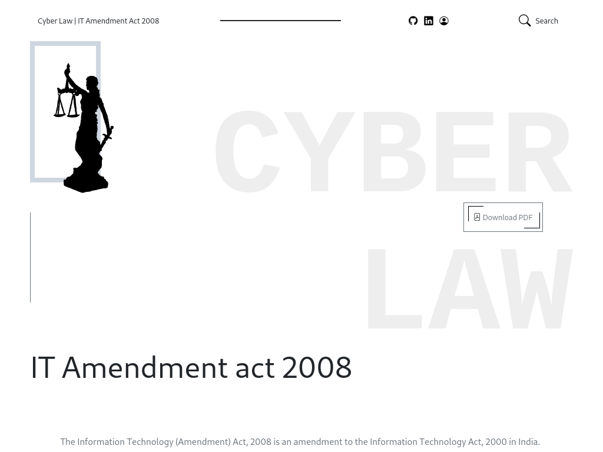

# website-10

- Name : "CyberLaw"

- Descript : ""

- Version : 2.0

- Status : ACTIVE

- Responsive : False

- TeckStack : { HTML5 | CSS3 | JavaScript }

- Thanks : { GitHub | VSCode | GIMP | Unplash | Bootstrap-Icon }

- Collabrate : { MayankDevil }

- URL : https://mayankdevil.github.io/CyberLaw/

- Clone : https://github.com/MayankDevil/CyberLaw.git

- Download : https://github.com/mayankdevil/cyberlaw/archive/refs/heads/main.zip

#### Look and Feel

#### Responsive

__This website is only responsive for large screen device.__

#### Theme

__Simpe light theme with dark shades__

### Copyright Notice

Designed | Developed Copyright (c) by _Mayank_ .

__This website Designed and Development property of Mayank and is protected under copyright law. Unathorized reproduction, distribution, or disclosure of this Project, or any part of this mayank Developed Content is strictly prohibited. But we are not claimed any content of IT Act law they are only Copyright (c) by Goverment of India.__

For permissions, please contact the respository owners through their Github profiles:

Any unauthorized use of the Designed and Development repository may constitute a violation of copyright law.

