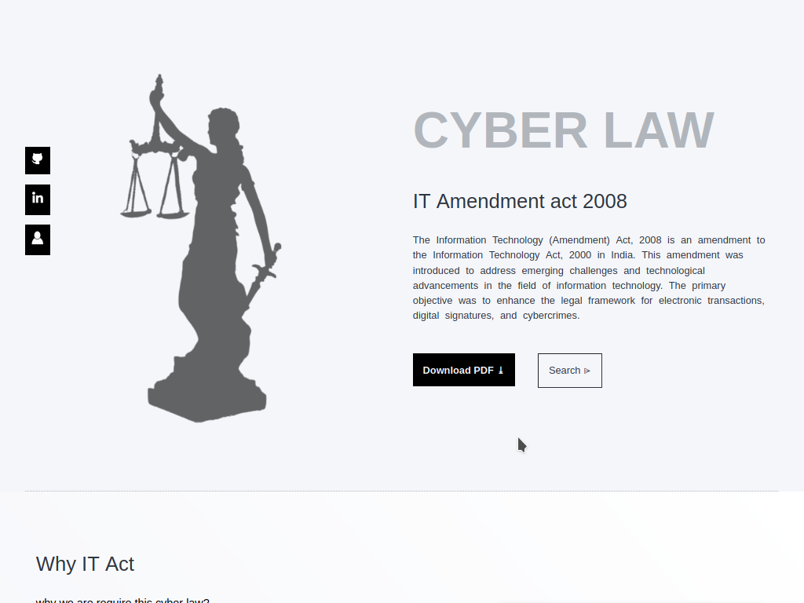

# website-10

- Name : "CyberLaw"

- Description : "Navigate cyber law with precision. Discover the impact of the 2008 IT Amendment Act at CyberLaw."

- Version : main

- Update : 30-01-2024

- Status : REST

- TecStack : { HTML | CSS | JavaScript }

- Responsive : False

- Thanks : { VSCodium | GitHub | Unplash | MayankDevil }

- Work : Self

- Design : { Mayank }

- Developer : { Mayank }

- CopyRight : { Goverment Of India }

- URL : https://mayankdevil.github.io/CyberLaw/

- Clone : https://github.com/MayankDevil/CyberLaw.git

- Download : https://github.com/MayankDevil/CyberLaw/archive/refs/heads/main.zip

---

#### Home Page

### Responsive

**Breakpoints** { 992 | 1200 } <!--375 | 576 | 768 | -->

### Theme

_uncover cyber law insights with clarity in a sleek black-and-white theme at CyberLaw._

### Warning

_"Caution: This GitHub repository serves as my personal cyber law note website. I disclaim responsibility for inaccuracies and assert copyright solely for the design and development of the website."_

<!--

india.gov.in
https://www.india.gov.in/
https://www.india.gov.in/calendar?a=1704745295790

Incometax department

https://incometaxindia.gov.in/pages/acts/income-tax-act.aspx

Sure, I can provide a simplified list of key sections of the Information Technology Act, 2000 in India. Keep in mind that this is a general overview, and you should refer to the actual legal text and consult with legal professionals for specific cases. As of my last knowledge update in January 2022, here's a summary:

1. **Section 1**: .

2. **Section 2**: 

3. **Section 3**:.

4. **Section 4**: 

5. **Section 5**: .

6. **Section 6**: .

7. **Section 7**: .

8. **Section 8**: .

9. **Section 9**: .

10. **Section 10**: .

11. **Section 11**: .

12. **Section 12**: .

13. **Section 13**: .

14. **Section 14**: .

15. **Section 15**: .

16. **Section 16**: .

17. **Section 17**: .

18. **Section 18**: .

19. **Section 19**: .

20. **Section 20**: .

21. **Section 21**: Certificate to be valid for other purposes.

22. **Section 22**: Representations upon applications.

23. **Section 23**: Other subscribers may obtain a digital signature certificate.

24. **Section 24**: Publication of Digital Signature Certificate's information.

25. **Section 25**: Digital Signature Certificate not to be granted in certain cases.

26. **Section 26**: Suspension of Digital Signature Certificate.

27. **Section 27**: Revocation of Digital Signature Certificate.

28. **Section 28**: Notice of suspension or revocation.

29. **Section 29**: Digital Signature Certificate to be the evidence.

30. **Section 30**: Controller to act as repository.

31. **Section 31**: Certifying Authority to follow certain procedures.

32. **Section 32**: Controller to act as a repository.

33. **Section 33**: Certificate to be valid for other purposes.

34. **Section 34**: Representations upon applications.

35. **Section 35**: Other subscribers may obtain a digital signature certificate.

36. **Section 36**: Publication of Digital Signature Certificate's information.

37. **Section 37**: Digital Signature Certificate not to be granted in certain cases.

38. **Section 38**: Suspension of Digital Signature Certificate.

39. **Section 39**: Revocation of Digital Signature Certificate.

40. **Section 40**: Notice of suspension or revocation.

41. **Section 41**: Digital Signature Certificate to be the evidence.

42. **Section 42**: Sections 28 to 41 to be prospective in operation.

43. **Section 43**: Punishment for tampering with computer source documents.

44. **Section 44A**: Penalty for failure to furnish information, return, etc.

45. **Section 45**: Residual powers of the Central Government.

46. **Section 46**: Power to arrest.

47. **Section 47**: Explanation of terms.

48. **Section 48A**: Penalty for misrepresentation.

49. **Section 49**: Power to give directions.

50. **Section 50**: Power of police officer and other officers to enter, search, etc.

51. **Section 51**: Penalty for failure to furnish information, return, etc.

52. **Section 52**: Residual powers of the Central Government.

53. **Section 53**: Power to arrest.

54. **Section 54**: Explanation of terms.

55. **Section 55**: Penalty for misrepresentation.

56. **Section 56**: Power to give directions.

57. **Section 57**: Power of police officer and other officers to enter, search, etc.

58. **Section 58**: Act to have an overriding effect.

59. **Section 59**: Offences by companies.

60. **Section 60A**: Powers to delegate.

61. **Section 61**: Act not to apply for certain documents.

62. **Section 62**: Protection of action taken in good faith.

63. **Section 63**: Power to make rules by the Central Government.

64. **Section 64**: Power to make rules by the State Government.

65. **Section 65**: Repeal and savings.

66. **Section 66**: Power to remove difficulties.

67. **Section 67A**: Power to intercept electronic information.

68. **Section 68B**: Notwithstanding anything contained in the Code of Criminal Procedure, 1973.

69. **Section 69A**: Power to issue directions for blocking for public access of any information.

70. **Section 69B**: Power to authorize to monitor and collect traffic data or information.

71. **Section 70**: Protected system.

72. **Section 71**: Penalty for misrepresentation.

73. **Section 72**: Penalty for breach of confidentiality and privacy.

74. **Section 73**: Penalty for publishing Digital Signature Certificate false in certain particulars.

75. **Section 74**: Publication for fraudulent purpose.

76. **Section 75**: Act to apply for the offences or contraventions committed outside India.

77. **Section 76**: Confiscation.

78. **Section 77**: Penalties or confiscation not to interfere with other punishments.

Please note that this is a simplified list, and for detailed legal interpretations, it's always advisable to consult with legal professionals or refer to the latest legal texts.
---

1. **Data Protection:** The amendment introduced provisions related to the protection of sensitive personal data and information __(Sections 43A and 72A)__.

2. **Penalties for Cybercrimes:** It increased penalties for various cyber offenses, including unauthorized access to computers __(Section 66)__ and data breaches.

3. **Introduction of New Offenses:** The amendment added new offenses, such as the publication or transmission of sexually explicit material __(Section 67A)__.

4. **Intermediary Liability:** Clarifications were made regarding the liability of intermediaries, like internet service providers and social media platforms __(Section 79)__.

5. **Compensation for Unauthorized Access:** The amendment specified compensation for damage caused by unauthorized access to computer systems __(Section 43)__.

6. **Enhanced Search and Seizure Powers:** It increased the powers of law enforcement agencies in terms of search and seizure of computer systems __(Section 69)__.

-->
